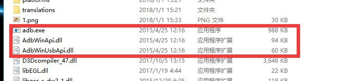
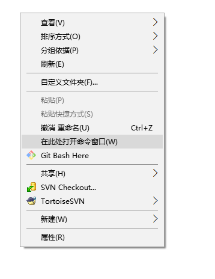
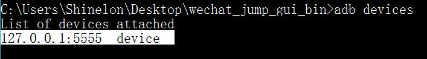
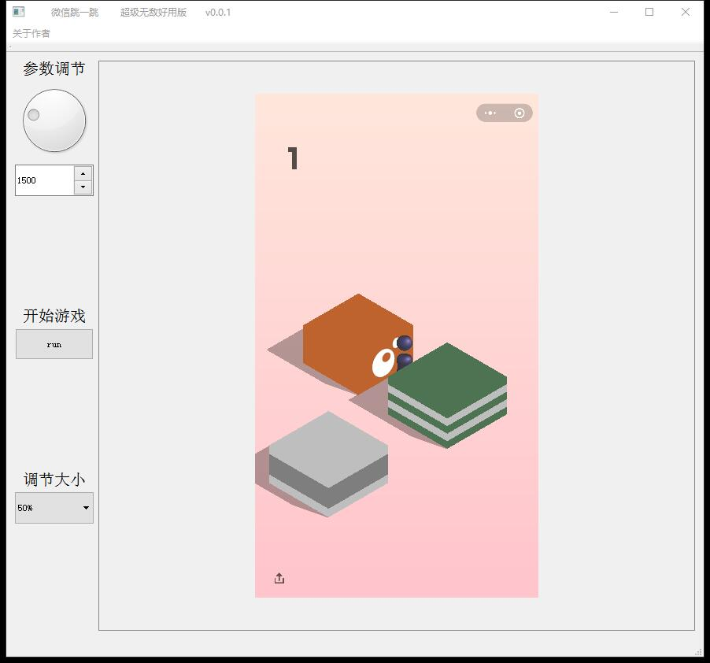

# wechat_jump_gui_bin
微信跳一跳可执行文件

# 工具
- 模拟器
- 本软件

# 准备工作
- 安装好模拟器
- 使用`adb`进行模拟器连接

# ADB使用方法
- 在本软件下有下载好的ADB

- 你可以按住`shift + 鼠标右键`快速打开命令行

使用`adb devices`命令查看是否连接模拟器

如果没有连接使用`adb connect 127.0.0.1:5555`进行连接

# 界面

# 使用
    1.确保模拟器已经连接上

    2.修改上面的参数（参数可以使用旋转盘或者输入框进行修改）

    3.点击run开始

# 知乎文章
[https://zhuanlan.zhihu.com/p/32525962](https://zhuanlan.zhihu.com/p/32525962)